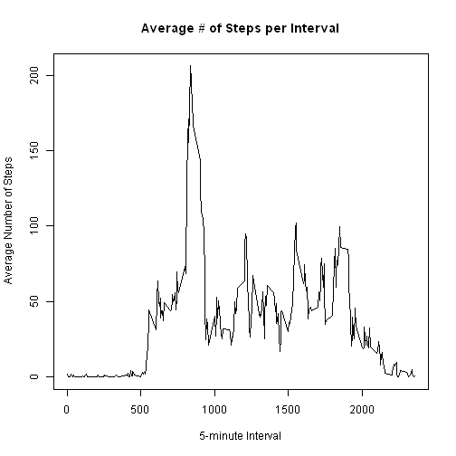

Reproducible Research 
========================================================
Peer Assessment 1
========================================================

# Loading and preprocessing the data #
### 1. Load the data ###
Load the data (i.e. read.csv()).


```r
# save the Url 
#activitydataUrl <- "https://d396qusza40orc.cloudfront.net/repdata%2Fdata%2Factivity.zip"

# download the zip file
#download.file(activitydataUrl, destfile = "activity.zip")

# extract the text file from the zip file
unzip("activity.zip")

# read the source data 
activityData <- read.csv("activity.csv", header = TRUE)
```

### 2. Process/transform the data ###
Process/transform the data into a format suitable for your analysis.


```r
# clean up the date
activityData[,2] <- as.Date(activityData[,2],"%Y-%m-%d")
```

# What is the mean total number of steps taken per day? #
For this part of the assignment, the missing values in the dataset are ignored.
### 1. Histogram of the total number of steps taken each day ###
Make a histogram of the total number of steps taken each day. 


```r
# Group steps by date, ignore NA steps
StepsbyDate <- tapply(activityData$steps, activityData$date, sum, na.rm = T)
hist(StepsbyDate, xlab = "Steps", main = "Total Number of Steps Taken Each Day")
```

 

### 2. Calculate the mean and median total number of steps taken ###
Calculate and report the mean and median total number of steps taken per day.


```r
meanSteps <- mean(StepsbyDate)
```

The mean total number of steps taken is 9354.2295.


```r
medianSteps <- median(StepsbyDate)
```

The median total number of steps taken is 10395.

# What is the average daily activity pattern? #
### 1. Time series plot ###
Make a time series plot (i.e. type = "l") of the 5-minute interval (x-axis) 
and the average number of steps taken, averaged across all days (y-axis).


```r
# Group steps by interval, ignore NA steps, compute average
StepsbyInterval <- tapply(activityData$steps, activityData$interval, mean, na.rm = T)
plot(levels(as.factor(activityData$interval)), StepsbyInterval, type = "l",
     xlab = "5-minute Interval", ylab = "Average Number of Steps", 
     main = "Average # of Steps per Interval")
```

 

### 2. 5-minute interval containing the maximum number of steps ###
Which 5-minute interval, on average across all the days in the dataset, 
contains the maximum number of steps?


```r
MaxStepInterval <- StepsbyInterval[which(StepsbyInterval == max(StepsbyInterval))]
```

Averaged across all days, the 5-minute interval containing the maximum 
number of steps is interval number 835.

# Imputing missing values #
### 1. The total number of missing values ###
Calculate and report the total number of missing values in the dataset.


```r
missingvalues <- sum(is.na(activityData$steps))
```

The total number of missing values is 2304.

### 2. Devise a strategy for filling in the missing values ###
Devise a strategy for filling in all of the missing values in the dataset.

I will use the means as calculated previously and saved as StepsbyInterval.


```r
dfSteps <- as.data.frame(as.table(StepsbyInterval))
colnames(dfSteps) <- c("interval", "steps")
# add column of interval means as steps_temp
activityData <- merge(activityData, dfSteps, by = "interval", suffixes = c("","_temp"))
# replace NA with interval mean
activityData$steps[is.na(activityData$steps)] <- activityData$steps_temp[is.na(activityData$steps)]
```

### 3. Create a new dataset with the missing data ###
Create a new dataset that is equal to the original dataset but with the missing 
data filled in.


```r
# order by date, interval
activityData <- activityData[order(activityData$date, activityData$interval),]
# drop the steps_temp column of interval means
keep <- c("interval","date","steps")
activityData <- activityData[keep]
```

### 4a. Make a histogram of the total number of steps taken ###
Make a histogram of the total number of steps taken each day and Calculate and report the mean and median total number of steps taken per day.


```r
StepsbyDate <- tapply(activityData$steps, activityData$date, sum, na.rm = T)
hist(StepsbyDate, xlab = "Steps", main = "Total Number of Steps Taken Each Day")
```

 

### 4b. Calculate and mean and median total number of steps taken ###
Calculate and report the mean and median total number of steps taken per day.


```r
meanSteps2 <- mean(StepsbyDate)
```

The mean total number of steps taken each day is 1.0766 &times; 10<sup>4</sup>.


```r
medianSteps2 <- median(StepsbyDate)
```

The median total number of steps taken each day is 1.0766 &times; 10<sup>4</sup>

### 4c. Do these values differ from the first part of the assignment? ###
Do these values differ from the estimates from the first part of the assignment?  

The mean from the first part of the assignment was 9354.2295, while the
new mean is 1.0766 &times; 10<sup>4</sup>.  The median from the first part of the assignment
was 10395, while the new median is 1.0766 &times; 10<sup>4</sup>.

### 4d.What is the impact of imputing missing data? ###
What is the impact of imputing missing data on the estimates of the total daily 
number of steps?

The impact of imputing missing data increases the estimates of the mean/median
of the total number of steps taken each day.

# Are there differences between weekdays and weekends? #
Are there differences in activity patterns between weekdays and weekends? 
### 1. Create a new variable with two levels - "weekday" and "weekend ###
Create a new factor variable in the dataset with two levels - "weekday" and "weekend indicating whether a given date is a weekday or weekend day.


```r
#activityData$DayofWeek <- weekdays(activityData$date)
activityData$daytype <- ifelse(weekdays(activityData$date) %in% c("Saturday","Sunday"),
                               "weekend","weekday")
```

The new factor variable daytype was added to the dataset.

### 2. Panel plot containing a time series plot ###
Make a panel plot containing a time series plot (i.e. type = "l") of the 5-minute 
interval (x-axis) and the average number of steps taken, averaged across all 
weekday days or weekend days (y-axis). 


```r
# subset the activityData into weekend and weekday sets
weekendData <- subset(activityData, activityData$daytype == "weekend")
weekdayData <- subset(activityData, activityData$daytype == "weekday")

# get the interval means for the subsets
weekendMeans <- tapply(weekendData$steps, weekendData$interval, mean, na.rm = T)
weekdayMeans <- tapply(weekdayData$steps, weekdayData$interval, mean, na.rm = T)

# plot of the 5-minute interval and average number of steps taken
par(mfrow = c(2, 1))
plot(weekendMeans, type = "l", main = "Weekend", xlab = "5 minute interval",
     ylab = "Average # of steps")
plot(weekdayMeans, type = "l", main = "Weekday", xlab = "5 minute interval",
     ylab = "Average # of steps")
```

 

